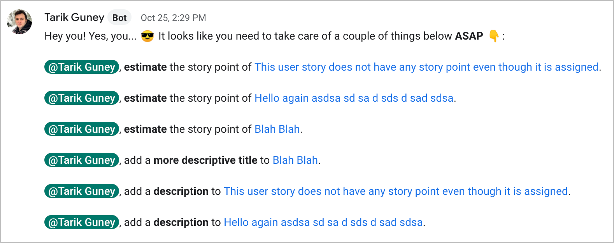
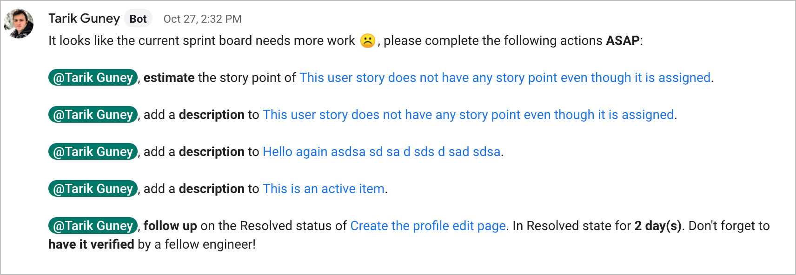

# Management Automation

## What
As an engineering manager, you figure that most of your time goes to repetitive tasks that includes reminding your team of the importance of keeping the sprint board up-to-date for more accurate work tracking. There could be many reasons why you find yourself in this situation, but regardless of the reason, the Manager Automation automation will take some of that burden off your shoulders. It will continously analyze the current sprint's board and will remind the team the missing pieces that are important for the smooth execution of every sprint.

## Underlying Design Principle
The solution is intentionally kept simple and visible. It communicates the required actions through Google Chat (and Slack, etc. in the future) in simple and concise words. It is visible and repetitive, as these are the perhaps some of the most effective factors to incorporate cultural elements into the daily life of a team. Rare communication of a hard -to-remember tasks will not make it into the team culture early enough. They have to communicated frequently in a place where it is most visible in a way that makes it easy to follow to become a part of the team culture.

## How does it look like?

There are some screenshots of the messages below for you to see what's being communicated. Note that for the full list of messages and communication, the source code  will be best place to check for now.

### In-Sprint Action Reminders
Manager Automation service sends daily reminders like the following and reminder series of actions to the team members by mentioning their name so that they get notifications through the Google Chat. The following images demonstrates various of type of messages sent for further action to the Google Chat.

### Reminders 

This function application consists of three major functions:
1. Current Iteration Automation 
1. End of iteration Automation
1. Restrospective Automation 
1. Managers-only Reminders

### Curent Iteration Automation

Most of the reminders go out as part of the current iteration automation executions. This automation analyses the current iteration (aka. Sprint) using Azure DevOps API from various points and send reminders to the responsible parties to make sure they are addressed. These check points are:
1. Missing description in work items (defects and user stories)
1. Indescriptive work item titles
1. Work items without story points
1. Work items in Resolve state for more than 12 hours
1. Assigned but not activated work items. Reminds the responsible parties to activate the work item they are working on.
1. Congratulate the ones with all closed work items.

These reminders are sent out twice every day; one in the morning and one in afternoon.

### End of the Sprint Reminders

On the last day of the sprint, the reminders change. In addition to the ones above, it also automates:

1. If there are work items that are still active, it reminds the possible action items.

### Restrospective Automation

In the first day of the sprint, this automation checks if there is any remaining work from the previous sprint. It simply runs the existing checks and report them differently that is more appropriate for the first day of the next sprint.

### Managers-only Automation

I will document offline.