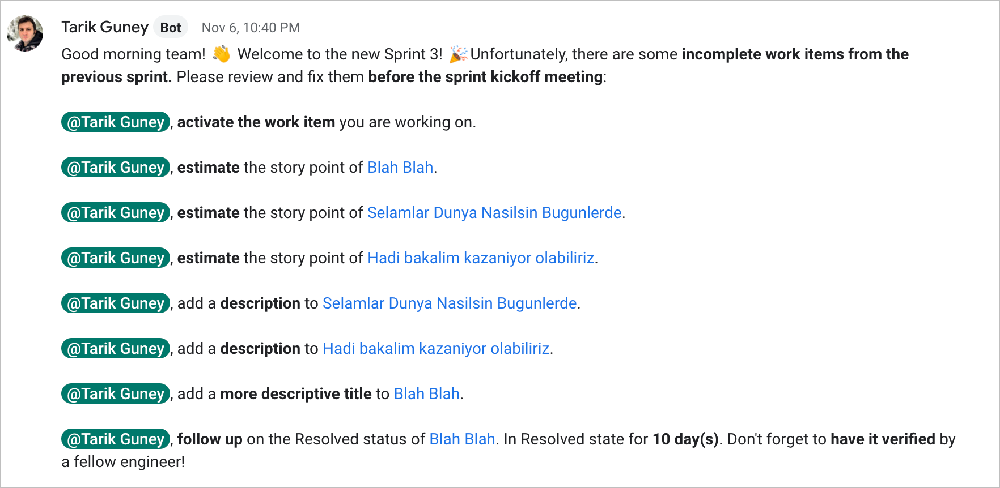
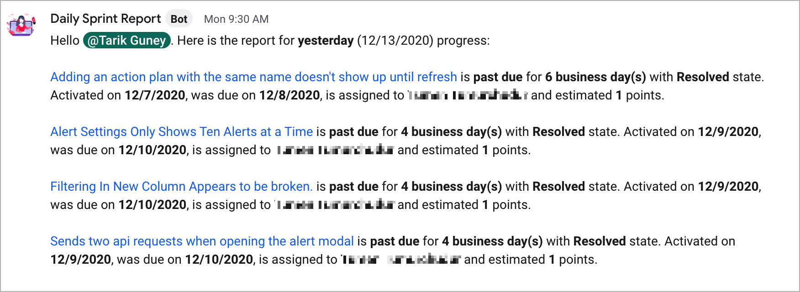

Developed with the following technologies:

 

# Management Automation

## What is it?
**As an engineering manager, you realize that a lot time of your time goes to repetitive tasks that includes reminding your team of the importance of keeping the sprint board up-to-date for more accurate work tracking.** There could be many reasons why you find yourself in this situation, but regardless of the reason, the Manager Automation will take some of that burden off your shoulders. It will continously analyze the current sprint's board and will remind the team the missing information in the form actionable reminders that are important for the smooth execution of every sprint. **Note that these reminders play an important role in guiding the team and new hires towards the expectations of the team and company culture.**

## Underlying Design Principle
The solution is intentionally kept simple and visible. It communicates the required actions through Google Chat (and Slack, etc. in the future) in simple and concise words. It is visible and repetitive, as these are the perhaps some of the most effective factors to incorporate cultural elements into the daily life of a team. Rare communication of hard-to-remember tasks will not make into the team culture early enough. They have to be communicated frequently in a place where they are most visible in a way that makes them easy to follow by the team to become a part of the team culture.

## How does it look like?

There are some screenshots of the messages below for you to see what's being communicated. Note that for the full list of messages and communication, the source code  will be best place to check for now.

### In-Sprint action reminders
Manager Automation service sends daily reminders like the following and reminder series of actions to the team members by mentioning their name so that they get notifications through the Google Chat. The following images demonstrates various of type of messages sent for further action to the Google Chat.

### End-of-sprint action reminders
Manager Automation service embeds certain situational facts in the reminder text. For example, it changes its greeting when it is the last day of the sprint to draw people's attention to the fact that the sprint is about to end and there might be some missing information in the sprint. It also guides the team members how the incomplete work must be handled based on the time available and committed time for the work item.

### New sprint action reminders
When it is the first day of the new sprint, the automation service will analyze the previous sprint one more time and  bring up any issues that are left unresolved.

## Managers-only reminders
As an engineering manager, it is often crucial to be aware of the progression of the work on time, and catch the delay before they become a big problem. There might be many reasons why a work is delayed. For instance, the engineering might be blocked. Regardless of the reason, if a task is taking unreasonable more time it should, then you will need to reach out and see what's going on and how you can help the team member with the progression of the work. The Manager Automation service collects this information for you -- the engineering manager -- and report them to you daily in a private Google Chat room. 

## The Complete List of Reminders 
This function application consists of three major functions:
1. Current Iteration Automation 
1. End of iteration Automation
1. Restrospective Automation 
1. Managers-only Reminders

### Curent Iteration Automation
Most of the reminders go out as part of the current iteration automation executions. This automation analyses the current iteration (aka. Sprint) using Azure DevOps API from various points and send reminders to the responsible parties to make sure they are addressed. These check points are:
- Missing description in work items (defects and user stories)
- Indescriptive work item titles
- Work items without story points
- Work items in Resolve state for more than 12 hours
- Assigned but not activated work items. Reminds the responsible parties to activate the work item they are working on.
- Congratulate the ones with all closed work items.

These reminders are sent out twice every day; one in the morning and one in afternoon.

### End of the Sprint Reminders
On the last day of the sprint, the reminders change. In addition to the ones above, it also automates:

- If there are work items that are still active, it reminds the possible action items.

### Restrospective Automation
In the first day of the sprint, this automation checks if there is any remaining work from the previous sprint. It simply runs the existing checks and report them differently that is more appropriate for the first day of the next sprint.

### Managers-only Automation

- Due date reminders. 

## Setup and Configuration

TBD